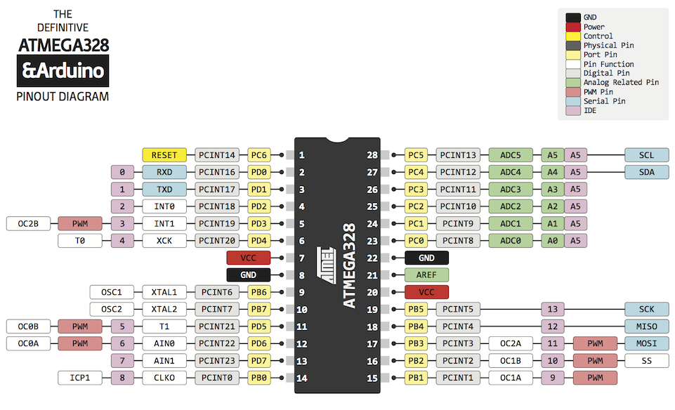
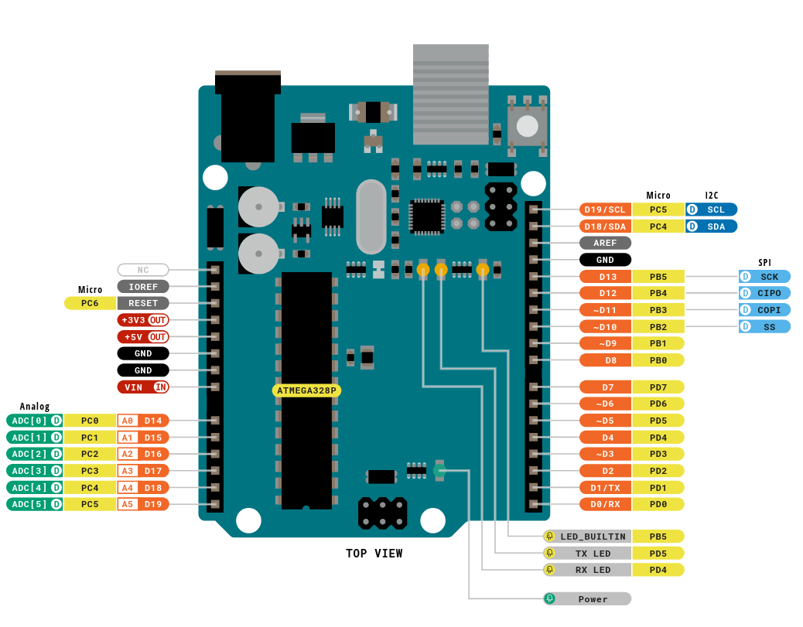
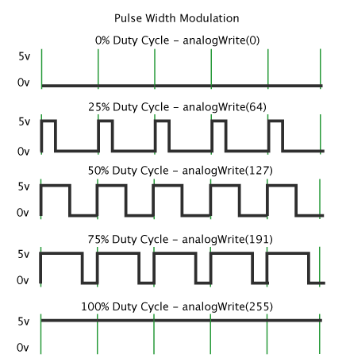
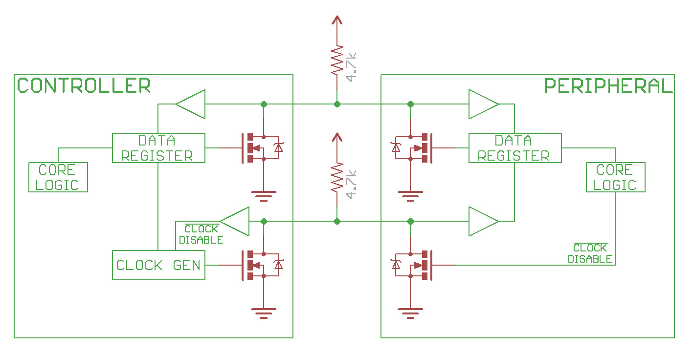
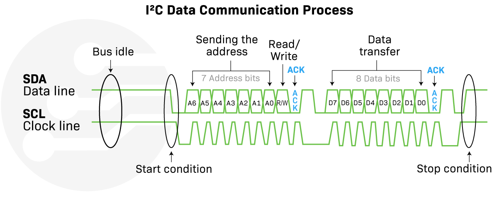

# 1. Introduction to the Arduino Uno R3
The Arduino Uno R3 is a microcontroller development board designed by Arduino with which we can control various components. It is a small and compact microcontroller board that has 6 analog **input** pins, 14 digital **I/O** pins, 5V and 3.3V output pins, reset button and reset pin and more. In this article I will be discussing the ins and outs of the Arduino Uno R3 and its capabilities to document the features and serve as a reference for future projects. It is one of the most popular and widely used microcontroller boards for various reasons. It is beginner friendly, easy to use, has a big following and community support and lots of libraries. For these reasons, the Arduino Uno R3 is a must-have for beginners.

# 2. Technical Specifications
The Arduino Uno has the **ATMega328P** and the **ATMega16U2** microcontrollers which have a multitude of features that will be discussed further in this section. Both microcontrollers run on a 5V AVR 8-bit architecture. The **ATMega328P** clocks at up to 16 MHz.

## 2.1. Memory
The Arduino Uno R3 has **2** microcontrollers, namely:
  - The **ATMega328P**: This is the main microcontroller and where you upload your code to. It has 32 kB of Flash, 2 kB SRAM and 1 kB EEPROM memory and is easily accessible.
  - The **ATMega16U2** is where the firmware is stored and is used for USB-to-serial communication. It has 16 kB of Flash, 512 B SRAM and 512 B of EEPROM memory and is not easily accessible.
We will focus on the **ATMega328P** characteristics.
### 2.1.1. Flash memory
Flash memory is a storage medium that is non-volatile, which means that after power is cut off it **does not** erase itself. You can overwrite it or reset it completely. The **ATMega328P** has 32 kB of Flash memory so you can upload code into it to execute tasks. A small part of the Flash memory is dedicated to the bootloader[^1]. The main function of the bootloader is to receive data from the **ATMega16U2** (via USB-to-serial) and to write it into the **ATMega328P**'s Flash memory.
### 2.1.2. SRAM
Static Random Access Memory, SRAM, is a volatile storage medium. It will hold on to its data as long as power is connected. Data can be accessed, read or written, randomly like any other RAM memories. For example:
```
#define LED_D2 2
int counter = 0;
```
Here ```#define LED_D2 2``` will not be stored in the SRAM because it **is not** a variable[^2] while ```int counter = 0``` is a **variable** and will be stored in the SRAM. All variables are stored in the SRAM by default unless specified otherwise.
### 2.1.3. EEPROM
Electrically Erasable Programmable Read-Only Memory is a non-volatile storage medium. It stores data byte by byte and is easily accessible on the Arduino IDE with the EEPROM library ```#include <EEPROM.h>```. This is very useful when you need some specific data to be stored even if the Arduino is powered off. 

## 2.2. Peripherals
>A peripheral device, or simply peripheral, is an auxiliary hardware device that a computer uses to transfer information externally.^5

The Arduino has plenty of peripherals, but we will focus on the most important ones.

### 2.2.1. Digital I/O pins
I/O is short for Input/Output. The Arduino Uno has 20 digital pins with and 14 without the analog pins. Of the 14 digital pins, only 12 (or 18 with analog pins) are recommended to use as digital pins, because some have other functions like the tx and rx pins that can interfere with serial communication. Digital pins output 0V (logic low) or 5V (logic high) or if they are PWM (Pulse Width Modulation) pins, a range between 0 and 5V. These digital pins can be used to power a LED, 7 segment displays, servo motors and much more, which shows the versatility of these pins. Coupled with the analog pins, which can be used to read from sensors or precisely output certain voltages.



#### PWM pins


PWM pins are denoted with the ```~``` symbol and are able to output a range between 0 and 5V by changing their duty cycle. The duty cycle is a term that refers to the time that a system/signal is active, or on, and expressed as a percentage. The PWM pins are pin D3, D5, D6, D9, D10 and D11. These pins can be used with ```analogWrite(pin, x)``` to output a certain voltage. 
The Arduino Uno R3 has a 10-bit Analog to digital converter (ADC), but the Arduino uses a 8-bit converter for the PWM pins. They use different timers to output a certain voltage[^3]. This means that the ```x``` value lies between 0 and $`2^8 - 1`$, or 0 to 255. As shown in the image above ```analogWrite(pin, x)``` will change the on/off state time. 50% duty cycle can be achieved by setting x equal to 127. The formula to calculate ```x``` is shown below.
```x = duty cycle * 2^n - 1``` with n the number of bits and the duty cycle in percent.

### 2.2.2. Communication protocols
#### USART protocol

#### I2C protocol
I2C, or inter-Integrated circuit, is one of the most used communication protocols. It works by connecting the SDA and SCL from the master/controller (ex: Arduino Uno R3) to one or multiple slaves/peripherals (ex: MCP6050). The benefits of I2C are that you can connect multiple slaves and masters, you only need 2 wires to exchange data, **Serial DAta** (SDA) and **Serial CLock** (SCL), and you can attach a maximum of 1008 devices[^4]. 



First you need to connect the master(s), and the slave(s), with the SDA/SCL bus. If the slave does not have a pull up resistor [^5], you need to add one to both the SCL and SDA line. Then connect **VCC** and **GND**, and that's it for the connections. The most difficult aspect of I2C is how it works.

##### I2C the workings
Serial Clock is clock signal while Serial Data is the data signal. The clock signal synchronizes the communication between the devices and is generated by the master[^6].
Serial Data is used to send or receive data bits.

Before the clock begins to oscillate, there needs to be a start condition. This condition happens when the SDA line goes low **while** the SCL line is high. Then, it send a total of 8 bits, 1 byte, which 7 contains the slave addresses. Even if you connect only one slave it will always send 7 bits for the slave address. and every bit is a **0** or **1**. This means that you can have a maximum of $`2^7 - 1`$ or 127 unique slave addresses[^7]. Then the last bit will indicate if the master wants to write or read to the slave. A **1** means that it will request data (read), and a **0** means that it will send data (write). After the byte is sent, the **receiver** of the address byte will receive one more bit, the ACK/NACK bit. ACK means that everything went well and is denoted with a **0**. NACK mean that something went wrong and no data could be exchanged and is denoted with a **1**.
The second part is where the master receives or writes 1 byte of data with once again a ACK or NACK bit after the byte. At the end there is a stop condition, and this condition occurs when SDA line goes high **while** SCL line is high. So the SDA line **only** changes when the SCL line is also high


#### SPI protocol

### 2.2.3. Analog Comparator

### 2.2.4. Analog to Digital Converter (ADC)


>The Arduino Uno R3 is rated to work at a minimum temperature of -40 °C and at a maximum temperature fo 85 °C (it is mentioned that at these extreme temperatures some components might not work).


# Sources
1. https://en.wikipedia.org/wiki/Flash_memory
2. https://en.wikipedia.org/wiki/Static_random-access_memory
3. https://cplusplus.com/doc/tutorial/preprocessor/
4. https://docs.arduino.cc/learn/built-in-libraries/eeprom/
5. https://en.wikipedia.org/wiki/Peripheral
6. https://docs.arduino.cc/learn/microcontrollers/analog-output/
7. https://learn.sparkfun.com/tutorials/i2c/all

[^1]: 0.5 kB is not accessible and reserved for the bootloader

[^2]: ```#define``` is a preprocessing macro (3)

[^3]: The timers used are: timer0 (8 bit) pin 5 and 6, timer1 (16 bit) pin 9 and 10, timer2 (8 bit) pin 3 and 11. *Note: You could use the 16-bit timer to have a more steps, but arduino standardised it to 8-bit

[^4]: If multiple masters, they cannot exchange data to each other through SDA and SCL bus and they need to take turns to use the SDA and SCL bus. Also in reality you would only use 127 devices (see I2C the workings).

[^5]: A pull_up resistor is a resistor that is directly connected VCC.

[^6]: Even though the clock signal is generated by the master/controller some slaves/peripherals may keep the signal low to delay the data transfer.
 
[^7]: There are 127 possibilities because 0 is reserved.